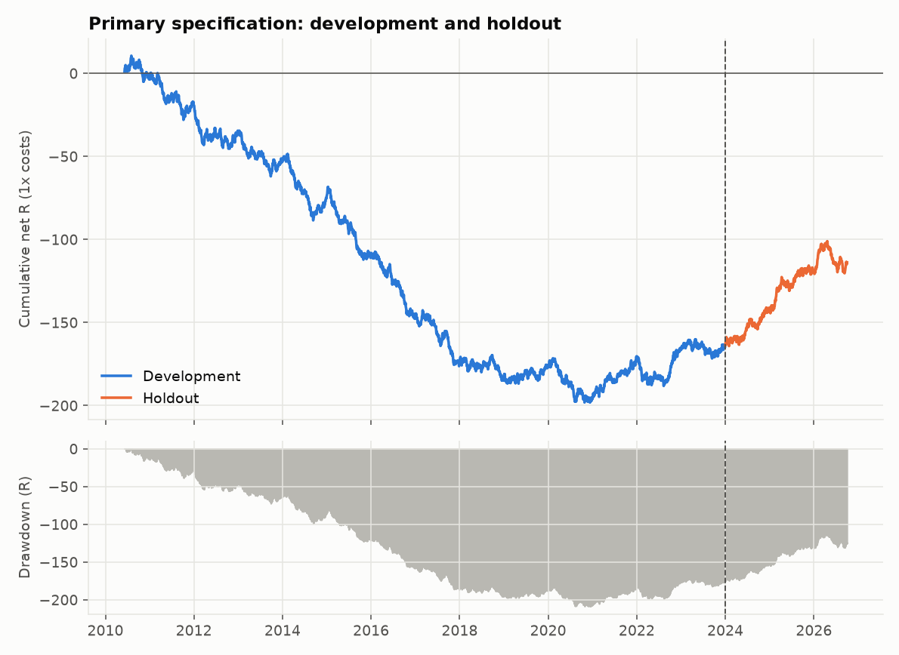
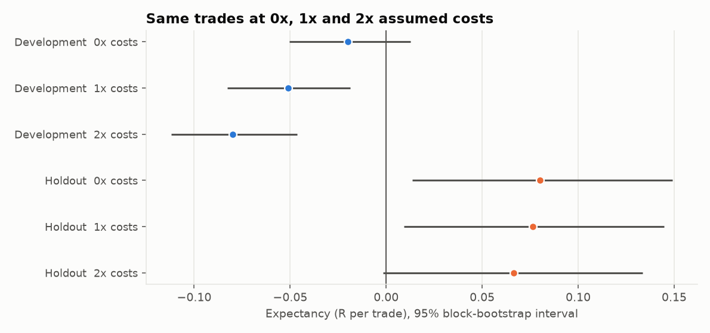
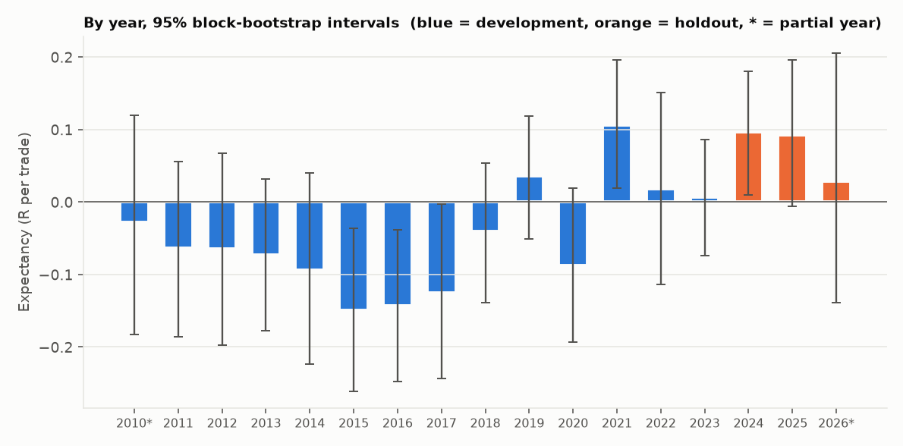

# Final report: does a 15-minute opening range breakout on NQ have a real edge?

> Reproduction of the final run, for verification only. No decision may be taken from it.

## 1. Bottom line

**No edge established.**

* **What was tested.** The textbook 15-minute opening range breakout on NQ: after the first 15 minutes of the US session, go long (short) when a 1-minute bar closes above (below) the range, stop at the other side of the range, target 1x the risk, flat by 15:55, one trade a day.
* **Development, 2010-06-08 to 2023-12-29 (3,229 trades).** After assumed costs it lost 0.051 R per trade on average (95% interval -0.083 to -0.019); about -69,516 dollars for one NQ contract.
  Before any cost it was -0.020 R, indistinguishable from zero. In the full development period (Stages 6-7), across 96 parameter combinations (range length, stop, target) only 5 were positive after costs, and after correcting for having tried them all, none was distinguishable from luck.
* **Holdout, 2024-01-02 to 2026-10-01 (665 trades).** On data that no decision had ever seen, it made money, and the gain is large enough to be distinguishable from zero: +0.076 R per trade (95% interval +0.008 to +0.145), +90,265 dollars for one NQ. At 2x costs: +0.067 R.
* **Two ideas formed along the way** (it works better in high-volatility regimes; the breakout direction carries information beyond market drift) were each tested once on the holdout: volatility not supported, direction not supported.
* The pre-declared conditions for claiming an edge were not all met. Failed: (c) the development result contradicts it: its interval at 1x costs lies entirely below zero.
* **How strong is the holdout gain?** Its interval is +0.008 to +0.145 R, so the lower end is only +0.008 R: the result clears zero narrowly. The one-sided bootstrap p-value is about 0.015 (below the Bonferroni level of 0.0167 for three declared tests). The Sharpe interval is -0.20 to +2.28 and the profit-factor interval 0.95 to 1.40 (both include the no-edge values); at 2x costs the expectancy interval is -0.002 to +0.133 R.
* **Is it the breakout, or the market?** The direction test did not support breakout information (p = 0.126); over the same entry-to-close windows the market itself moved +4.19 bps. In the holdout the long trades averaged +0.115 R and the short trades +0.039 R. A gain that comes mainly from the long side while NQ is rising is what market drift would also produce.
* **It reverses the earlier history.** Development was -0.051 R per trade (interval -0.083 to -0.019); the holdout is +0.076 R. The rule's performance clearly is not stable over time, and the one regime explanation we tested in advance (prior volatility) does not account for it (test (ii) in section 4).

**In plain English:** the evidence is **mixed**. For 13.5 years this rule lost money after costs; the later, untouched data show a gain that is statistically positive but only just, that is not shown to come from the breakout itself, and that contradicts the earlier history. By the rules we set in advance that is **not** enough to call it an edge. It is a reason to keep observing the rule on genuinely new data, not a reason to expect profits. This is a statement about this specific rule on this data, not proof that no breakout strategy can work, and it is not investment advice.

## 2. How it was tested (and why the result can be trusted more than a typical backtest)

* **Data and timing.** Databento 1-minute NQ futures, 2010-2026, verified by hash; UTC converted to New York time with daylight saving checked; only the regular session; one raw-price contract per day chosen from the *previous* day's volume, so a contract roll can never create a fake gap or fake profit. Holidays, half-days, vendor-flagged and incomplete days are excluded and counted (Stage 2).
* **No lookahead.** Two independent implementations of the signals and of the fills (vectorised and bar-by-bar) must agree exactly; garbage written into the future must not move a trade; deliberately injected bugs must be caught by the tests (Stages 3-4, 7).
* **Costs and fills are explicit and conservative.** Commission $2.00/side per NQ ($0.50 MNQ), 1 tick of slippage on market-type fills, a stop wins if stop and target are touched in the same minute, a gap through the stop loses the full gap. Results at 0x / 1x / 2x costs are shown.
* **No cherry-picking.** The 2024+ holdout stayed locked behind an explicit switch whose use is logged; all rules (grid, selection, tests, thresholds, and how the conclusion would be drawn) were written down and committed **before** the results they govern; 98 variants and hypotheses were logged for the multiple-testing correction; sensitivity used neighbourhood smoothing rather than the single best cell.
* **Honest uncertainty.** Every interval comes from a block bootstrap that respects clustering in time; all tests that were not pre-declared are described as hypotheses, not findings.

## 3. Headline statistics (primary specification, 1x costs)

| Primary specification, 1x costs | Development | Holdout (untouched until the end) |
|---|---|---|
| Period | 2010-06-08 to 2023-12-29 | 2024-01-02 to 2026-10-01 |
| Tradable days | 3,236 | 665 |
| Trades | 3,229  (1,668 long / 1,561 short) | 665  (327 long / 338 short) |
| Win rate  [95% interval] | 48.1%  [46.4% to 49.7%] | 54.9%  [51.3% to 58.5%] |
| Average winner / loser (R) | +0.89 / -0.92 | +0.89 / -0.91 |
| Expectancy (R)  [95% interval] | -0.051  [-0.083 to -0.019] | +0.076  [+0.008 to +0.145] |
| Bootstrap share of resamples with expectancy > 0 | 0.1% | 98.5% |
| Profit factor  [95% interval] | 0.94  [0.85 to 1.03] | 1.14  [0.95 to 1.40] |
| Sharpe, annualised  [95% interval] | -0.78  [-1.30 to -0.25] | +1.07  [-0.20 to +2.28] |
| Sortino, annualised  [95% interval] | -1.06  [-1.70 to -0.37] | +1.59  [-0.22 to +3.69] |
| Net points (NQ costs) | -3,476  (-1.08 per trade) | +4,513  (+6.79 per trade) |
| Net $ for 1 NQ / 1 MNQ | -69,516 / -8,889 | +90,265 / +8,628 |
| Max drawdown: 1 NQ / 1 MNQ / in R | $117,661 / $13,484 / 208.7 R | $61,968 / $6,231 / 19.2 R |
| Longest time under water | 4,896 days (13.4 y) | 218 days (0.6 y) |
| Exposure (time in market) | 32.5%  (avg 127 min) | 31.7%  (avg 123 min) |
| Longest losing streak | 10 trades | 7 trades |

Partial year(s) in the annual statistics: 2010, 2026 (the data cover only part of the year; the last holdout date is 2026-10-01). "Bootstrap share" is the fraction of 10,000 resamples whose mean was above zero.

## 4. The three tests declared before the holdout was opened

| Declared test (D6/D8) | Rule | Result | Outcome |
|---|---|---|---|
| (i) Primary spec, 1x costs | interval for expectancy entirely above 0 = positive; entirely below = negative | +0.076  [+0.008 to +0.145] | positive and distinguishable |
| (ii) Primary spec, high-volatility tercile only (D3) | high-tercile interval entirely above 0 (needs >= 20 trades) | 240 trades: +0.036  [-0.059 to +0.133] | NOT supported |
| (iii) Breakout direction vs drift (D5) | permutation p-value < 0.05 (Bonferroni for 3 tests: < 0.0167) | signal-direction hold-to-close +4.06 bps vs -0.07 +/- 3.58 if random; p = 0.126 | NOT supported |

Three tests were declared, so a Bonferroni-adjusted level of 0.0167 is also relevant for the permutation test; the pre-declared rules in the table were applied unchanged.
Direction detail: mean hold-to-close return was +8.39 bps for longs and -0.12 bps for shorts (in trade direction), against an always-long benchmark of +4.19 bps.

## 5. Costs: the same trades at 0x, 1x and 2x

| cost level | period | trades | expectancy (R) [95% interval] | $ (1 NQ) | $ (1 MNQ) |
|---|---|---|---|---|---|
| 0x | development | 3,229 | -0.020  [-0.051 to +0.013] | -31,490 | -3,149 |
| 0x | holdout | 665 | +0.080  [+0.014 to +0.149] | +95,015 | +9,502 |
| 1x | development | 3,229 | -0.051  [-0.083 to -0.019] | -69,516 | -8,889 |
| 1x | holdout | 665 | +0.076  [+0.009 to +0.145] | +90,265 | +8,628 |
| 2x | development | 3,229 | -0.080  [-0.112 to -0.046] | -106,227 | -14,498 |
| 2x | holdout | 665 | +0.067  [-0.002 to +0.133] | +79,195 | +7,122 |

## 6. By year

Development:

| year | trades | win rate | expectancy (R) [95% interval] | $ (1 NQ) | $ (1 MNQ) |
|---|---|---|---|---|---|
| 2010* | 133 | 51.1% | -0.028  [-0.183 to +0.120] | -1,437 | -224 |
| 2011 | 243 | 49.0% | -0.063  [-0.186 to +0.056] | -3,677 | -514 |
| 2012 | 241 | 47.3% | -0.065  [-0.197 to +0.067] | -1,479 | -292 |
| 2013 | 243 | 46.5% | -0.073  [-0.178 to +0.032] | -3,577 | -504 |
| 2014 | 235 | 45.1% | -0.093  [-0.223 to +0.040] | -4,815 | -622 |
| 2015 | 239 | 43.1% | -0.150  [-0.261 to -0.036] | -16,916 | -1,835 |
| 2016 | 243 | 43.2% | -0.143  [-0.247 to -0.039] | -11,792 | -1,325 |
| 2017 | 236 | 43.6% | -0.125  [-0.243 to -0.003] | -11,574 | -1,299 |
| 2018 | 238 | 47.9% | -0.041  [-0.138 to +0.054] | -16,482 | -1,791 |
| 2019 | 233 | 51.9% | +0.036  [-0.051 to +0.119] | +6,338 | +494 |
| 2020 | 233 | 47.2% | -0.087  [-0.194 to +0.020] | -44,382 | -4,578 |
| 2021 | 240 | 57.1% | +0.106  [+0.019 to +0.196] | +40,975 | +3,954 |
| 2022 | 234 | 50.4% | +0.018  [-0.113 to +0.151] | -7,946 | -935 |
| 2023 | 238 | 51.3% | +0.007  [-0.074 to +0.086] | +7,248 | +582 |

Holdout (partial years marked *):

| year | trades | win rate | expectancy (R) [95% interval] | $ (1 NQ) | $ (1 MNQ) |
|---|---|---|---|---|---|
| 2024 | 242 | 55.0% | +0.096  [+0.010 to +0.181] | +31,087 | +2,964 |
| 2025 | 240 | 55.0% | +0.093  [-0.006 to +0.196] | +45,835 | +4,440 |
| 2026* | 183 | 54.6% | +0.028  [-0.138 to +0.205] | +13,343 | +1,224 |

## 7. By regime and by side (development and holdout combined for regimes)

| regime | trades | win rate | expectancy (R) [95% interval] | $ (1 NQ) | $ (1 MNQ) |
|---|---|---|---|---|---|
| 2010s low-vol | 2,284 | 46.7% | -0.077  [-0.116 to -0.039] | -65,411 | -7,912 |
| 2020 COVID | 233 | 47.2% | -0.087  [-0.190 to +0.019] | -44,382 | -4,578 |
| 2021 post-COVID | 240 | 57.1% | +0.106  [+0.019 to +0.194] | +40,975 | +3,954 |
| 2022 bear market | 234 | 50.4% | +0.018  [-0.114 to +0.153] | -7,946 | -935 |
| 2023 onward (development + holdout) | 903 | 53.9% | +0.058  [+0.003 to +0.113] | +97,513 | +9,210 |

| period | side | trades | expectancy (R) [95% interval] | $ (1 NQ) |
|---|---|---|---|---|
| development | long | 1,668 | -0.039  [-0.083 to +0.004] | -16,577 |
| development | short | 1,561 | -0.064  [-0.111 to -0.016] | -52,939 |
| holdout | long | 327 | +0.115  [+0.018 to +0.209] | +77,662 |
| holdout | short | 338 | +0.039  [-0.079 to +0.151] | +12,603 |

"2023 onward" combines 2023 (development) with the holdout years. These cuts are descriptive; none was used to select anything.

## 8. Limitations and what could invalidate this

* **One history.** 2010-2026 is a single path through a long bull market in NQ; results can differ in other eras or instruments.
* **Assumed costs.** There is no quote data. Slippage and commission are assumptions (defaults used unless replaced by broker numbers in `config/config.yaml`); limit-order fills on touch are optimistic.
* **1-minute bars hide intrabar order.** The stop-first rule is conservative; in the data it affected very few trades (Stage 4).
* **A short holdout** (665 trades) can only detect large effects; "not distinguishable from zero" is not the same as "equal to zero".
* **Excluded days** (holidays, half-days, roll days, vendor-degraded or incomplete days) are a deliberate sample restriction.
* **Other designs.** Different ranges, filters, instruments or exits were only tested within the pre-declared grid.

## 9. Disclosure: one wording correction made after the result was known

The conclusion text is generated from templates written before the holdout was opened. The template for "the rules say no edge" assumed the holdout would not be positive, so its plain-English sentence ("no reason to expect to make money")
was wrong for what actually happened, and it was corrected after the result was seen (see `docs/DECISIONS.md`, D9). **The verdict ("No edge established"), the rules, and every number are unchanged**; only the explanatory wording
and the added context bullets in section 1 were changed.

## 10. Reproducing this and the audit trail

* One command: `python -m orb run` rebuilds every stage from the raw file (with `ORB_UNLOCK_HOLDOUT=yes` it also re-derives this final report, in reproduction mode). `python -m pytest` runs the tests.
* Trials registered for the multiple-testing correction: **98** (`logs/trials.jsonl`). Decision log: `docs/DECISIONS.md` (D1-D8). Frozen volatility thresholds: `logs/frozen_vol_thresholds.json`.
* Holdout access log (`logs/holdout_access.log`) has 4 entries:

  * 2026-10-06T15:11:15+00:00 - daily - stage 8 FINAL holdout run (D8), the one and only decision run
  * 2026-10-06T15:11:16+00:00 - bars_chosen - stage 8 FINAL holdout run (D8), the one and only decision run
  * 2026-10-06T15:14:00+00:00 - daily - stage 8 reproduction of the final run (verification only, no decisions)
  * 2026-10-06T15:14:01+00:00 - bars_chosen - stage 8 reproduction of the final run (verification only, no decisions)
