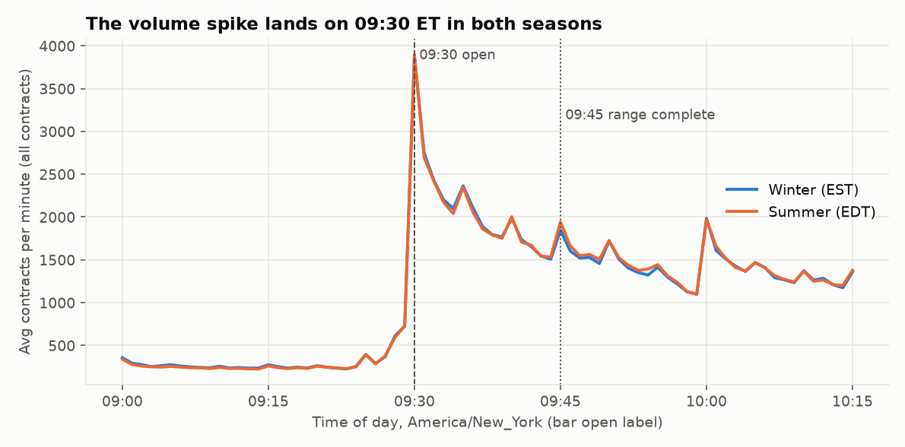
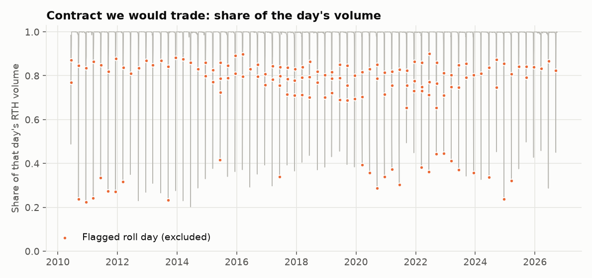
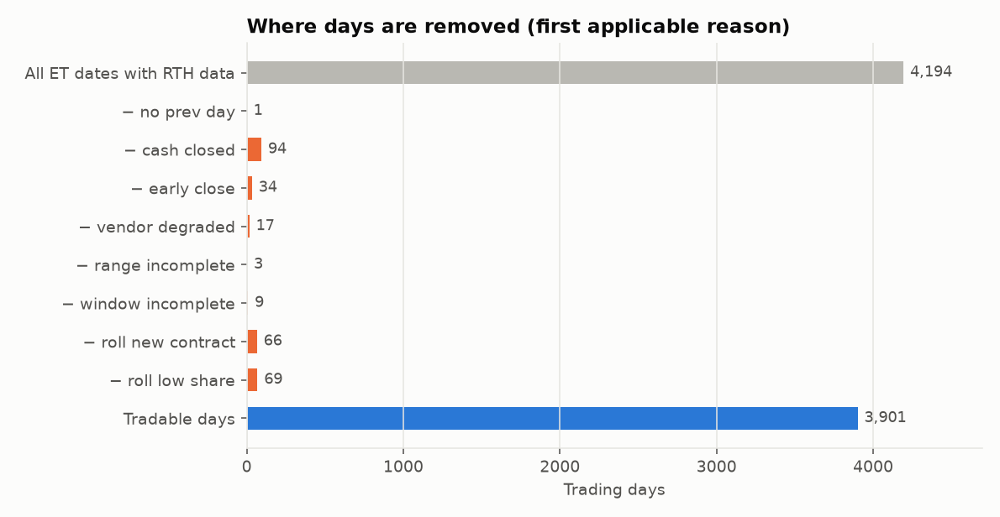
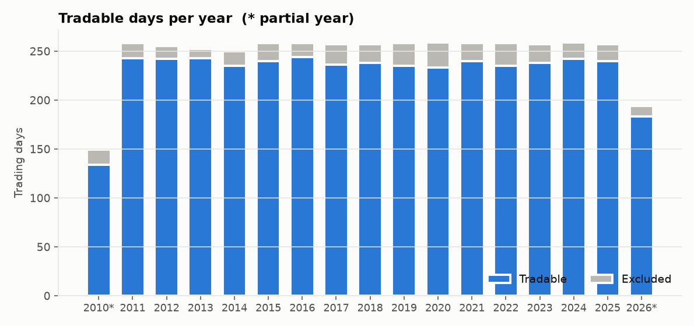

# Data-quality report (Stage 2)

Generated by `python -m orb data`. Every number below is computed from the raw file.
This report audits data **integrity and availability** over the full 2010-2026 range. It computes no
returns and no strategy statistics, so it does not touch the holdout in any statistical sense. Strategy
code only receives data through the guarded loaders in `orb/data/splits.py`.

## 1. Source file

| Item | Value |
|---|---|
| File SHA-256 | `779a2fb7815421da…` (matches the Databento manifest) |
| Rows in file | 14,566,859 |
| NQ outrights kept | 6,785,197 |
| NQ calendar spreads dropped | 546,935 |
| Other products dropped (MGCG, MGCJ, MGCM, MGCQ, MGCV, MGCZ) | 7,234,727 |
| First / last bar (UTC) | 2010-06-06 22:00:00 / 2026-10-01 23:59:00 |
| Instruments (contracts) | 71 |
| Session content | Full Globex session (~23h), 17:00-18:00 ET maintenance break; analysis uses 09:30-16:00 ET only |
| Price adjustment | None. Raw per-contract prices. Never stitched across contracts. |

## 2. Structural integrity

| check | count |
|---|---|
| rows | 6,785,197 |
| duplicate_ts_instrument | 0 |
| ohlc_invalid | 0 |
| non_positive_price | 0 |
| off_tick_grid | 0 |
| zero_volume_bars | 0 |
| instrument_ids_with_multiple_symbols | 0 |
| bars_range_gt_1pct | 273 |

Structural checks (duplicates, OHLC violations, non-positive prices, off-tick prices, one instrument_id
under several symbols) **abort the build if non-zero**. Zero-volume bars are not expected: the feed emits a
bar only for minutes with trades, so a "missing" minute means no trades, not a data hole.
Bars with a 1-minute range above 1% (largest: 4.2%) are listed in section 8 (top 10, contract we trade).

## 3. Timezone verification

Timestamps are UTC and mark the **start** of each bar. They are converted with the tz database
(`America/New_York`), never a fixed offset.

| bar | avg contracts/min |
|---|---|
| 09:29 ET bar | 726 |
| 09:30 ET bar | 3,888 |

* Median 09:30 / 09:29 volume ratio: **5.9x**. The jump is more than 3x on **91.7%** of all days
  and on **92.4%** of the 422 days inside the US/EU
  daylight-saving mismatch windows (Mar 8-31, Oct 25-Nov 7), where a wrong conversion would fail first.
* The 09:30 ET bar falls at **EST: 14:00 UTC (1,411 days); EDT: 13:00 UTC (2,783 days)**: exactly one UTC hour per season, shifting by one hour when US clocks change.

## 4. Contracts and rolls

* Contract symbols are reused every decade (`NQH0` = Mar-2010 and Mar-2020), so everything is keyed on
  `instrument_id`. Expiry is derived from the first-seen date (third Friday of the month).
* **66** changes of volume leader. The old contract's expiry was a median **7** calendar days
  away at the switch (min 3, max 8). Full list in `rolls.csv`.
* We trade the **previous day's** RTH-volume leader, so selection never uses information from the trading day.
  Prices are raw and the whole trade lives in one contract, so a roll cannot create a price gap or P&L.
* Roll-flagged days (first day on a new contract, or the leader held < 80% of volume the day before): **142**.
* Diagnostic (uses same-day volume, never used for selection): the chosen contract was also that day's leader on
  **98.4%** of days (66 mismatches, of which 26 are roll-flagged).
  Share of the day's RTH volume held by the chosen contract (1%/5%/median): non-roll days (0.505, 0.933, 0.999), roll days (0.234, 0.289, 0.795).
* Chosen contract already expired on the trade date: **0** days.

## 5. Which days are usable

| Item | Count |
|---|---|
| ET dates with RTH data | 4,194 |
| **Tradable days** | **3,901** (93.0%) |

| rule | days_flagged | removed_as_first_reason |
|---|---|---|
| no_prev_day | 1 | 1 |
| no_chosen_bars | 1 | 0 |
| cash_closed | 94 | 94 |
| early_close | 34 | 34 |
| vendor_degraded | 18 | 17 |
| range_incomplete | 6 | 3 |
| window_incomplete | 140 | 9 |
| roll_new_contract | 66 | 66 |
| roll_low_share | 142 | 69 |

*days_flagged* counts every day a rule applies to; *removed_as_first_reason* attributes each day to the highest-priority
rule so the waterfall adds up exactly. Tolerance: 0 missing bars allowed in the range,
0 in the rest of the window to 15:55.
The three March-2020 days with too few range bars are limit-down halts: excluding them is a (small) choice that removes
some of the most violent opening sessions, noted as a caveat.

| year | dates | tradable | excluded |
|---|---|---|---|
| 2010 | 149 | 134 | 15 |
| 2011 | 258 | 243 | 15 |
| 2012 | 255 | 242 | 13 |
| 2013 | 252 | 243 | 9 |
| 2014 | 250 | 235 | 15 |
| 2015 | 258 | 240 | 18 |
| 2016 | 258 | 244 | 14 |
| 2017 | 257 | 236 | 21 |
| 2018 | 257 | 238 | 19 |
| 2019 | 258 | 235 | 23 |
| 2020 | 259 | 233 | 26 |
| 2021 | 258 | 240 | 18 |
| 2022 | 258 | 235 | 23 |
| 2023 | 257 | 238 | 19 |
| 2024 | 259 | 242 | 17 |
| 2025 | 257 | 240 | 17 |
| 2026 | 194 | 183 | 11 |

2010 starts in June and 2026 ends Oct 1, so both are partial years.

## 6. Vendor quality ledger (`condition.json`)

Databento's own per-day status for the whole download: **5,154** dates, **32** marked `degraded`
(the rest `available`). **18** degraded dates carry ET regular-session data and are excluded
by default (`filters.exclude_vendor_degraded`); the other 14 are weekends or sessions with no
RTH data at all. Degraded dates: 2014-06-11, 2014-06-12, 2014-06-13, 2014-06-15, 2014-09-22, 2014-09-23, 2014-09-24, 2014-09-25, 2017-11-13, 2018-10-21, 2019-01-15, 2019-02-22, 2019-03-13, 2019-03-26, 2020-02-27, 2020-02-28, 2020-05-05, 2020-06-30, 2020-07-01, 2021-12-05, 2022-01-02, 2024-09-18, 2025-09-17, 2025-09-24, 2025-11-28, 2026-01-31, 2026-03-15, 2026-03-16, 2026-03-21, 2026-04-10, 2026-05-24, 2026-08-29.

## 7. Calendar cross-check (NYSE vs the bars)

* NYSE sessions in range: 4,106; ET dates with RTH data: 4,194.
* NYSE sessions with **no** RTH data: **6** ['2014-06-12', '2014-06-13', '2014-09-23', '2014-09-24', '2014-09-25', '2014-12-31']. 5 of them are vendor-`degraded`;
  the remainder is an unexplained hole in the file (it simply cannot be traded).
* Data dates when NYSE was closed (CME short session, no real cash open): 94
* NYSE half-days present in the data: 34
* Days where the bars end before 14:00 ET: 128; calendar agrees on 128.
* Bars short but calendar says normal: []
* Calendar says short/closed but bars run to the normal close: []

## 8. Extreme 1-minute bars on the contract we trade

Ten largest 1-minute ranges (RTH). A bad print would show a large range on **ordinary** volume; real shocks come
with volume many times the norm for that minute. Rows at ordinary volume (< 1.5x the median for that minute): 2020-03-16 09:45 NQH0 (day tradable: False); 2020-03-18 09:31 NQM0 (day tradable: False).

| time_et | contract | range_pct | volume | vol_x_median_for_minute | day_tradable |
|---|---|---|---|---|---|
| 2025-04-09 13:19 | NQM5 | 3.440 | 7,907 | 20.900 | True |
| 2020-03-16 09:45 | NQH0 | 2.950 | 1,103 | 0.700 | False |
| 2020-03-03 10:00 | NQH0 | 2.310 | 8,318 | 5.000 | True |
| 2025-04-07 11:14 | NQM5 | 2.130 | 5,393 | 8.200 | True |
| 2025-04-09 13:20 | NQM5 | 2.040 | 2,381 | 5.400 | True |
| 2020-03-18 15:59 | NQM0 | 1.930 | 10,316 | 2.400 | False |
| 2025-04-07 10:18 | NQM5 | 1.790 | 6,155 | 6.300 | True |
| 2025-04-07 13:00 | NQM5 | 1.760 | 4,640 | 8.600 | True |
| 2025-04-07 10:10 | NQM5 | 1.760 | 6,327 | 5.400 | True |
| 2020-03-18 09:31 | NQM0 | 1.710 | 2,447 | 1.000 | False |

## 9. Caveats and what could invalidate this

* **Abrupt-flip roll days are not excluded.** 40 tradable-looking days are days where volume flipped to the next
  contract *that same day* after the old contract held >= 80% the day before. We cannot know that in advance, so these days
  trade the old contract while it still held between 20% and ~100% of the volume (thousands of
  contracts a minute). Stage 6 will rerun results with roll days included/excluded to show whether it matters.
* The "timestamp = bar open" convention is established by the 09:30 spike, not by documentation.
* One consolidated feed: no bid/ask, so spreads and slippage are assumptions (Stage 4).
* Excluded days are a deliberate sample restriction (293 of 4,194); results apply to normal full sessions on non-roll days.
* "No trades in a minute" is treated as a data gap that excludes the day. That is conservative but removes some quiet days.
