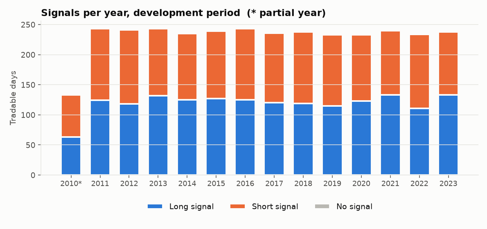
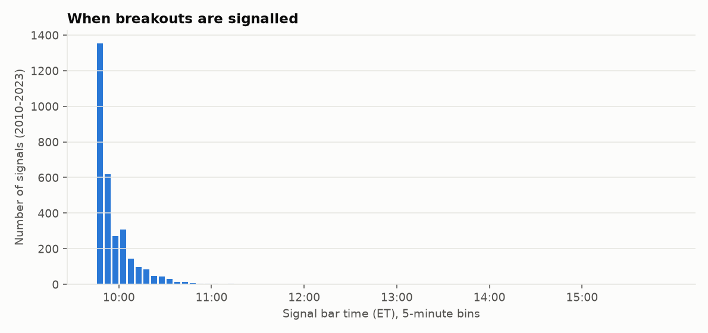

# Signal engine report (Stage 3)

Development data only (2010-06-08 to 2023-12-29, tradable days). The 2024+ holdout was not loaded.
This report is descriptive: **no profit and loss is computed** (that needs the execution model of Stage 4).

## 1. Rules as implemented

| Rule | Value |
|---|---|
| Opening range | high/low of the first **15** one-minute bars (labelled 09:30 to 09:44 ET) |
| Range complete | 09:45:00 ET |
| Breakout | a bar **closes strictly beyond** the range (equal is not a breakout); judged on the close only |
| First possible signal bar | the bar labelled 09:45 (it closes at 09:46:00) |
| Entry | **open of the next bar** after the signal bar |
| Latest entry bar | 15:54 ET (a later signal is not traded) |
| Trades per day | at most one (first breakout in either direction) |

## 2. How we know there is no lookahead

* **Reference implementation.** A bar-by-bar state machine that is fed one bar at a time (so it cannot see the future) must
  produce exactly the same signals as the vectorised engine: tested on 1,000 randomised days (range lengths 5/15/30/60) and on
  real development data.
* **Perturbation tests.** Overwriting every bar after the entry bar's open, the entry bar's own high/low/close, bars after the
  range window, or any other day, with random garbage leaves the signal unchanged; changing the signal bar's close or the entry bar's
  open *does* move it (so the test can fail).
* **Mutation tests.** Six deliberately injected bugs (range one bar too long, entry on the signal bar, breakout on the high,
  tie counted as breakout, entry at the next close, cut-off ignored) were each caught by the suite.
* **Timing convention.** A bar is labelled by its open, so its close is known one minute later. Signals use only closed bars.

Residual look-ahead in the *day universe* (not the signal): days with a missing minute later in the session are excluded, which a live
trader could not know at 09:46. That removes 12 development days (days removed for this reason alone; calendar
and roll exclusions are separate) and slightly favours quieter days.

## 3. Signal counts

| | Days | Share |
|---|---|---|
| Tradable development days | 3,236 | |
| Long signals | 1,668 | 51.5% |
| Short signals | 1,561 | 48.2% |
| No signal | 7 | 0.2% |

| year | days | long | short | no_signal | signal_rate |
|---|---|---|---|---|---|
| 2010 | 134 | 63 | 70 | 1 | 99.3% |
| 2011 | 243 | 124 | 119 | 0 | 100.0% |
| 2012 | 242 | 118 | 123 | 1 | 99.6% |
| 2013 | 243 | 132 | 111 | 0 | 100.0% |
| 2014 | 235 | 125 | 110 | 0 | 100.0% |
| 2015 | 240 | 127 | 112 | 1 | 99.6% |
| 2016 | 244 | 125 | 118 | 1 | 99.6% |
| 2017 | 236 | 120 | 116 | 0 | 100.0% |
| 2018 | 238 | 119 | 119 | 0 | 100.0% |
| 2019 | 235 | 115 | 118 | 2 | 99.1% |
| 2020 | 233 | 123 | 110 | 0 | 100.0% |
| 2021 | 240 | 133 | 107 | 0 | 100.0% |
| 2022 | 235 | 111 | 123 | 1 | 99.6% |
| 2023 | 238 | 133 | 105 | 0 | 100.0% |

2010 starts in June. The mix of long and short reflects only how often price leaves the range upward vs downward, not whether
either direction makes money.

## 4. When signals occur

| when | share of signals |
|---|---|
| signal bar before 10:00 ET | 0.701 |
| signal bar before 10:30 ET | 0.936 |
| signal bar from 15:00 ET | 0.001 |

## 5. Opening-range width

| percentile | points | ticks | % of price | $ per NQ contract |
|---|---|---|---|---|
| 5th pct | 6.500 | 26.000 | 0.189 | 130 |
| 25th pct | 11.250 | 45.000 | 0.293 | 225 |
| 50th pct | 20.000 | 80.000 | 0.405 | 400 |
| 75th pct | 48.750 | 195 | 0.571 | 975 |
| 95th pct | 108 | 430 | 0.988 | 2,150 |

## 6. Edge cases the execution model (Stage 4) must handle

* **Gap past the stop.** The entry bar can open beyond the opposite side of the range (so the risk would be zero or negative):
  **0** of 3,229 signals (0.00%). These cannot be traded with a range-based stop and need an explicit rule.
* **Entry slippage vs the signal close.** The first price after the signal bar closes, measured in the breakout direction
  (positive = worse for us than the close that triggered the signal):

| percentile | ticks |
|---|---|
| 5th pct | -2.000 |
| 25th pct | -1.000 |
| median | 0.000 |
| 75th pct | 1.000 |
| 95th pct | 2.000 |
| 99th pct | 3.000 |

* **Risk per trade** if the stop is the opposite side of the range, measured from the actual entry price (signals with positive risk):

| percentile | points | $ per NQ contract | $ per MNQ contract |
|---|---|---|---|
| 5th pct | 7.250 | 145 | 14.500 |
| 25th pct | 12.500 | 250 | 25.000 |
| 50th pct | 21.500 | 430 | 43.000 |
| 75th pct | 53.500 | 1,070 | 107 |
| 95th pct | 116 | 2,320 | 232 |

  This is the denominator of every R-multiple. Commission and slippage are fixed per contract, so they weigh more on narrow-range days.

## 7. Parameters

All of these are in `config/config.yaml`: `session.range_minutes`, `session.cash_open`, `session.flat_time`, `signal.last_entry_bar`.
