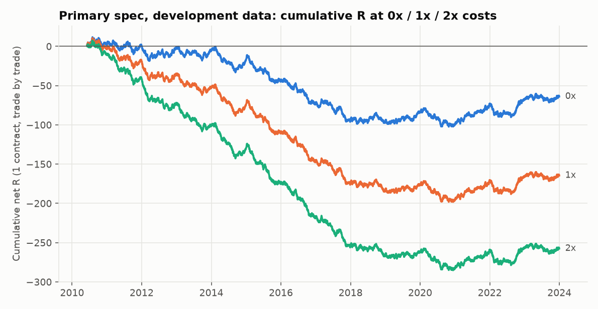

# Execution-model report (Stage 4)

Development data only (2010-06-08 to 2023-12-29). The 2024+ holdout was not loaded.
Strategy parameters are the ones fixed in the brief and are **not tuned**: 15-minute range, stop at the opposite side of the range,
1R target, one contract, one trade per day. This report is about how fragile the result is to cost and fill assumptions.
It is **not** the full backtest (Stage 5 adds the trade log and by-year views; Stage 8 the statistics and confidence intervals).

## 1. Execution rules as implemented

| Step | Rule |
|---|---|
| Entry | market order at the open of the bar after the signal, filled **1 tick(s)** (0.25 pt) worse at 1x |
| Levels | set from the **actual fill**: R = fill to stop; target = fill +/- 1 x R, rounded to the tick *away* from price (harder to hit) |
| Stop | opposite side of the opening range. Touched when the bar's low/high reaches it. **Filled 1 tick worse; if a later bar opens beyond it, we get that open (full gap loss)** |
| Target | resting limit order: fills at the target price on touch, no slippage (0 ticks). A gap past the target is not credited |
| Same-bar stop and target | **stop assumed first** (conservative). Flagged on each trade; optimistic bound shown in section 5 |
| Entry bar | checked too: it opens at our price, so its whole range comes after entry |
| Time exit | market order at the open of the 15:55 bar, 1 tick worse |
| Skipped trades | risk below 1 tick (e.g. entry gaps past the stop): counted, never silently dropped |
| Commission | $2.00 per side per NQ, $0.50 per side per MNQ (round trip = 2 sides) |
| Spread | not modelled separately (no quote data). It is folded into the slippage ticks, which are all-in adverse cost per market fill |
| Cost scale | multiplies commission **and** slippage together: 0x frictionless, 1x base, 2x double |

NQ tick = 0.25 pt = $5.00; MNQ tick = $0.50. Note MNQ commission is a much larger share of its P&L than NQ commission.

## 2. Trade mechanics at 1x costs

* Signals: 3,229. Trades taken: **3,229**. Skipped for tiny/negative risk: **0**.
* Same-bar stop-and-target ambiguity: **0** trades (0.0%), all booked as stop losses.
* Gap-through-stop exits: **0**.

| exit reason | trades | share | avg R |
|---|---|---|---|
| stop | 1,414 | 43.8% | -1.03 |
| target | 1,307 | 40.5% | +0.99 |
| time | 508 | 15.7% | -0.01 |

## 3. Results at 0x / 1x / 2x costs

| cost level | trades | win rate | expectancy (R) | 95% CI (R) | profit factor | avg net pts | total $ (1 NQ) | total $ (1 MNQ) |
|---|---|---|---|---|---|---|---|---|
| 0x (frictionless) | 3,229 | 48.9% | -0.020 | -0.052 to +0.012 | 0.97 | -0.49 | -31,490 | -3,149 |
| 1x (base) | 3,229 | 48.1% | -0.051 | -0.083 to -0.019 | 0.94 | -1.08 | -69,516 | -8,889 |
| 2x (double) | 3,229 | 47.4% | -0.080 | -0.112 to -0.047 | 0.91 | -1.64 | -106,227 | -14,498 |

*95% CI* is the naive interval for mean R treating trades as independent (it ignores clustering by regime, so it is too narrow);
Stage 7 replaces it with a bootstrap. Profit factor = gross wins / gross losses in dollars (NQ).

## 4. Slippage grid (commission at 1x)

| slippage per market fill | trades | win rate | expectancy (R) | 95% CI (R) | profit factor | avg net pts | total $ (1 NQ) | total $ (1 MNQ) |
|---|---|---|---|---|---|---|---|---|
| 0 ticks | 3,229 | 48.9% | -0.031 | -0.063 to +0.001 | 0.96 | -0.69 | -44,406 | -6,378 |
| 1 tick | 3,229 | 48.1% | -0.051 | -0.083 to -0.019 | 0.94 | -1.08 | -69,516 | -8,889 |
| 2 ticks | 3,229 | 47.5% | -0.069 | -0.102 to -0.037 | 0.92 | -1.44 | -93,311 | -11,268 |
| 3 ticks | 3,229 | 46.8% | -0.088 | -0.121 to -0.055 | 0.90 | -1.90 | -122,396 | -14,177 |

## 5. How much do the fill assumptions matter?

| fill assumption (1x costs) | trades | win rate | expectancy (R) | profit factor | total $ (1 NQ) |
|---|---|---|---|---|---|
| primary: stop wins ties, target fills on touch | 3,229 | 48.1% | -0.051 | 0.94 | -69,516 |
| target must trade 1 tick THROUGH | 3,229 | 47.9% | -0.054 | 0.93 | -75,236 |
| optimistic bound: ties go to the target | 3,229 | 48.1% | -0.051 | 0.94 | -69,516 |

The stop-first rule and the touch-fill rule bound what 1-minute bars can tell us. The distance between the pessimistic and optimistic rows is the
irreducible uncertainty from not having tick data.

## 6. Cost drag depends on range width (1x costs)

| range width | median risk (pts) | median risk ($ NQ) | avg cost ($ NQ) | cost as % of risk |
|---|---|---|---|---|
| narrowest quarter | 9.8 | $195 | $11.9 | 6.6% |
| 2nd | 16.2 | $325 | $12.1 | 3.7% |
| 3rd | 33.0 | $660 | $12.1 | 1.9% |
| widest quarter | 84.0 | $1,680 | $11.9 | 0.7% |

Costs are roughly fixed in dollars while risk scales with the range, so narrow-range days pay a far larger fraction of their risk in costs.

## 7. What could invalidate this

* **Slippage is an assumption.** 1 tick all-in per market fill is plausible for NQ in liquid RTH, but breakout entries and stops fill into moving
  markets and can be worse, particularly at the open and on news. The 2-3 tick rows are not paranoid.
* **Limit-order fills on touch are optimistic**: in reality a touch does not guarantee a fill. The "through" row is a proxy, not the truth.
* **No latency model.** We assume the entry bar's open is obtainable right after the signal bar closes.
* **1-minute bars hide intrabar order.** Section 2 counts how often that matters.
* Trials recorded so far (for the multiple-testing correction): **1** (already registered).
