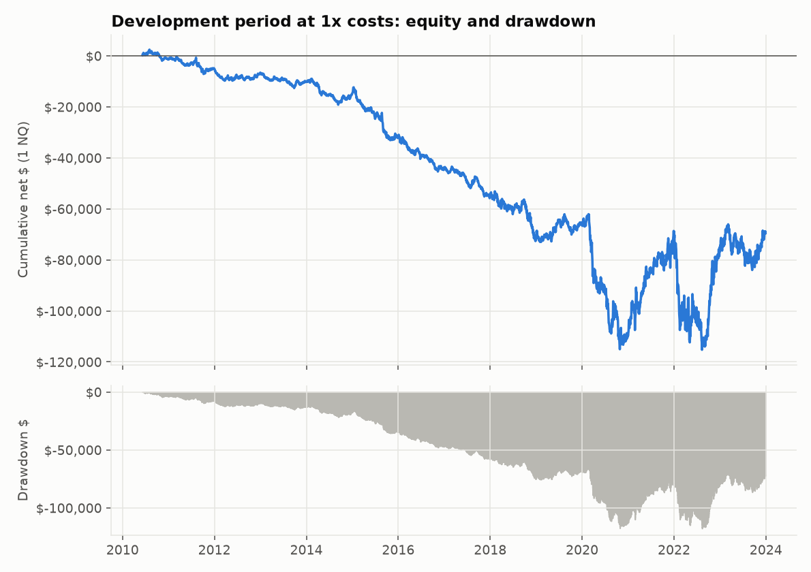
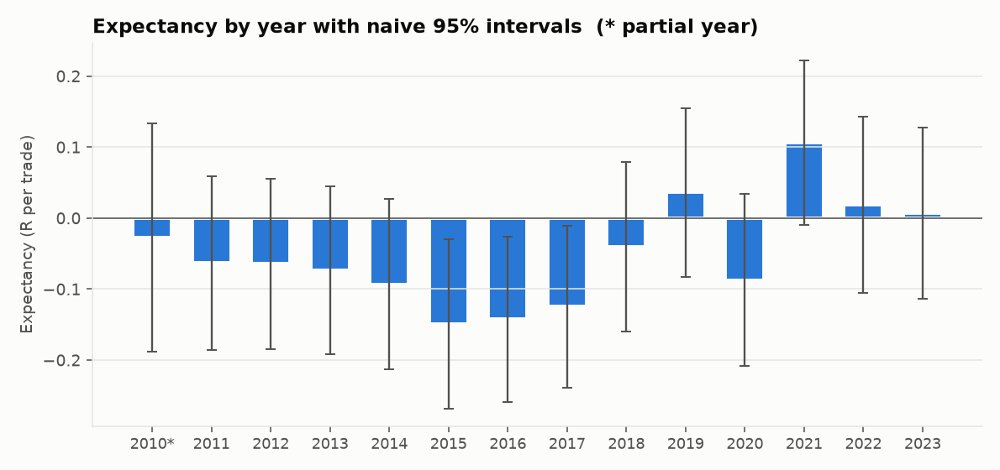

# Backtest report (Stage 5)

Development data only (2010-06-08 to 2023-12-29). The 2024+ holdout was **not** loaded. Specification is the brief's and is not tuned:
15-minute range, stop at the opposite side of the range, 1R target, max one trade a day, flat by 15:55,
one contract, costs at 1x ($2.00/side NQ, $0.50/side MNQ,
1 tick slippage on market-type fills). Trials registered so far: **1**.

The full trade log (every entry, exit, reason, R-multiple, and costs) is `outputs/backtest/trade_log_dev.csv` (local; not committed
because it contains market prices from licensed data). Rebuild it with `python -m orb backtest`.

## 1. Headline

| Metric (1x costs) | Value |
|---|---|
| Trades (long / short) | 3,229  (1,668 / 1,561) |
| Win rate | 48.1% |
| Average winner / loser (R) | +0.89 / -0.92 |
| Expectancy per trade | -0.051 R  =  -1.08 pts |
| Profit factor | 0.94 |
| Longest losing streak | 10 trades |
| Exposure (time in market / session time) | 32.5%  (avg 127 min per trade) |
| Max drawdown, 1 NQ / 1 MNQ / in R | $117,661 / $13,484 / 208.7 R |
| Longest time under water | 4,896 calendar days (13.4 years) |

## 2. P&L in points and dollars (NQ and MNQ)

| Whole development period, 1 contract | NQ ($20/pt) | MNQ ($2/pt) |
|---|---|---|
| Gross points (frictionless) | -1,542.2 | -1,542.2 |
| Slippage (points) | -1,287.8 | -1,287.8 |
| Commission (points) | -645.8 | -1,614.5 |
| NET POINTS | -3,475.8 | -4,444.5 |
| Gross $ | -30,845 | -3,084 |
| Slippage $ | -25,755 | -2,576 |
| Commission $ | -12,916 | -3,229 |
| NET $ | -69,516 | -8,889 |

Points are identical for NQ and MNQ (same index); dollars differ by the multiplier, and MNQ's commission is a bigger share of its P&L.
"Net points" for NQ and MNQ differ only because the fixed commission converts to a different number of points.

Dollar curves for a fixed one contract are dominated by the later years: NQ traded near 1,800 in 2010 and above 15,000 by 2023, so a one-contract
point is worth far more relative to price now, and ranges (hence R in dollars) are far larger. Compare eras in R, not dollars (section 4).

## 3. By exit reason

| exit reason | trades | share | avg R | $ (1 NQ) |
|---|---|---|---|---|
| stop | 1,414 | 43.8% | -1.025 | -1,071,946 |
| target | 1,307 | 40.5% | +0.989 | +989,322 |
| time | 508 | 15.7% | -0.014 | +13,108 |

Exit reason is decided by the outcome itself (a stop exit is a loser by construction), so no win rate or confidence interval is shown here:
that would be circular. Time exits are the only group where the result was not predetermined.

## 4. By year

| year | trades | win rate | expectancy (R) | naive 95% CI (R) | profit factor | net pts | $ (1 NQ) | $ (1 MNQ) |
|---|---|---|---|---|---|---|---|---|
| 2010* | 133 | 51.1% | -0.028 | -0.189 to +0.133 | 0.90 | -72 | -1,437 | -224 |
| 2011 | 243 | 49.0% | -0.063 | -0.185 to +0.058 | 0.88 | -184 | -3,677 | -514 |
| 2012 | 241 | 47.3% | -0.065 | -0.184 to +0.055 | 0.94 | -74 | -1,479 | -292 |
| 2013 | 243 | 46.5% | -0.073 | -0.192 to +0.045 | 0.86 | -179 | -3,577 | -504 |
| 2014 | 235 | 45.1% | -0.093 | -0.213 to +0.027 | 0.86 | -241 | -4,815 | -622 |
| 2015 | 239 | 43.1% | -0.150 | -0.269 to -0.030 | 0.70 | -846 | -16,916 | -1,835 |
| 2016 | 243 | 43.2% | -0.143 | -0.259 to -0.027 | 0.75 | -590 | -11,792 | -1,325 |
| 2017 | 236 | 43.6% | -0.125 | -0.239 to -0.011 | 0.71 | -579 | -11,574 | -1,299 |
| 2018 | 238 | 47.9% | -0.041 | -0.160 to +0.079 | 0.82 | -824 | -16,482 | -1,791 |
| 2019 | 233 | 51.9% | +0.036 | -0.083 to +0.155 | 1.10 | +317 | +6,338 | +494 |
| 2020 | 233 | 47.2% | -0.087 | -0.208 to +0.034 | 0.75 | -2,219 | -44,382 | -4,578 |
| 2021 | 240 | 57.1% | +0.106 | -0.010 to +0.222 | 1.30 | +2,049 | +40,975 | +3,954 |
| 2022 | 234 | 50.4% | +0.018 | -0.106 to +0.142 | 0.97 | -397 | -7,946 | -935 |
| 2023 | 238 | 51.3% | +0.007 | -0.114 to +0.127 | 1.05 | +362 | +7,248 | +582 |

4 of 14 years have positive expectancy; 0 have a naive 95% interval entirely above zero. With ~230 trades a year
and a standard error near 0.06 R, a single year cannot distinguish a real +0.05R edge from noise. 2010 is a partial year. The 2024-2026 years are in the holdout and are not shown.

## 5. By regime (development data only)

| regime | trades | win rate | expectancy (R) | naive 95% CI (R) | profit factor | net pts | $ (1 NQ) | $ (1 MNQ) |
|---|---|---|---|---|---|---|---|---|
| 2010s low-vol | 2,284 | 46.7% | -0.077 | -0.115 to -0.039 | 0.85 | -3,271 | -65,411 | -7,912 |
| 2020 COVID | 233 | 47.2% | -0.087 | -0.208 to +0.034 | 0.75 | -2,219 | -44,382 | -4,578 |
| 2021 post-COVID | 240 | 57.1% | +0.106 | -0.010 to +0.222 | 1.30 | +2,049 | +40,975 | +3,954 |
| 2022 bear market | 234 | 50.4% | +0.018 | -0.106 to +0.142 | 0.97 | -397 | -7,946 | -935 |
| 2023 onward | 238 | 51.3% | +0.007 | -0.114 to +0.127 | 1.05 | +362 | +7,248 | +582 |

"2023 onward" contains only 2023 until the holdout is run. 2021 is a bucket we added (the brief lists the other four).

## 6. By weekday and by side

| weekday | trades | win rate | expectancy (R) | naive 95% CI (R) | profit factor | net pts | $ (1 NQ) | $ (1 MNQ) |
|---|---|---|---|---|---|---|---|---|
| Monday | 576 | 48.8% | -0.031 | -0.106 to +0.045 | 0.90 | -1,063 | -21,254 | -2,471 |
| Tuesday | 652 | 47.1% | -0.069 | -0.142 to +0.003 | 0.98 | -211 | -4,218 | -813 |
| Wednesday | 668 | 46.7% | -0.082 | -0.154 to -0.010 | 0.84 | -1,907 | -38,132 | -4,214 |
| Thursday | 677 | 48.2% | -0.055 | -0.126 to +0.016 | 0.95 | -598 | -11,963 | -1,602 |
| Friday | 656 | 49.8% | -0.015 | -0.086 to +0.057 | 1.03 | +303 | +6,051 | +212 |

| side | trades | win rate | expectancy (R) | naive 95% CI (R) | profit factor | net pts | $ (1 NQ) | $ (1 MNQ) |
|---|---|---|---|---|---|---|---|---|
| long | 1,668 | 49.2% | -0.039 | -0.083 to +0.006 | 0.97 | -829 | -16,577 | -2,658 |
| short | 1,561 | 47.0% | -0.064 | -0.111 to -0.017 | 0.91 | -2,647 | -52,939 | -6,230 |

These cuts are descriptive. Slicing results many ways and then reading meaning into the best slice is a classic way to fool yourself: each cut is a
chance for a false positive, and none of them is used to select anything.

## 7. Post-hoc observation (a hypothesis to test, not a finding)

Looking at section 4, 2015-2017 are clearly negative while 2019 and 2021-2023 are around zero or slightly positive. A natural idea is "the strategy does better
in higher-volatility regimes". This was noticed **after** seeing the results, so it must not be treated as evidence: with 14 years and 5 regimes, some pattern
is always visible. It is logged in `docs/DECISIONS.md` (D3) and will be tested only with a volatility-regime definition fixed in advance (Stage 7), counted as
a trial, and judged again on the untouched holdout.

## 8. What could invalidate this

* All the cost and fill caveats of Stage 4 apply (slippage and limit-fill assumptions).
* Naive intervals ignore clustering of outcomes by volatility regime, so they are too narrow.
* Weekday/side/regime cuts split ~3,229 trades into small groups; apparent differences are mostly noise unless they are large and consistent.
