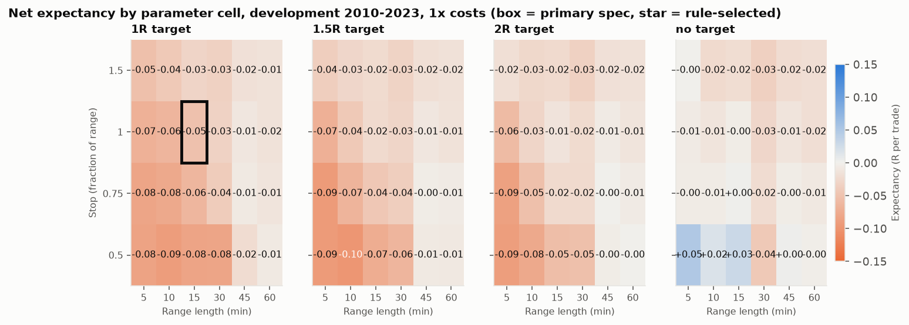
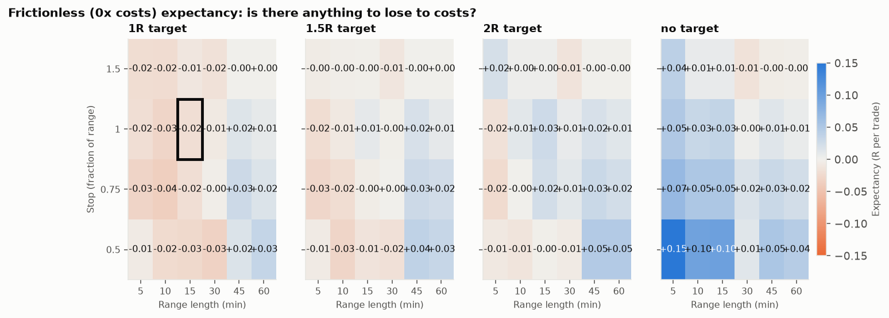
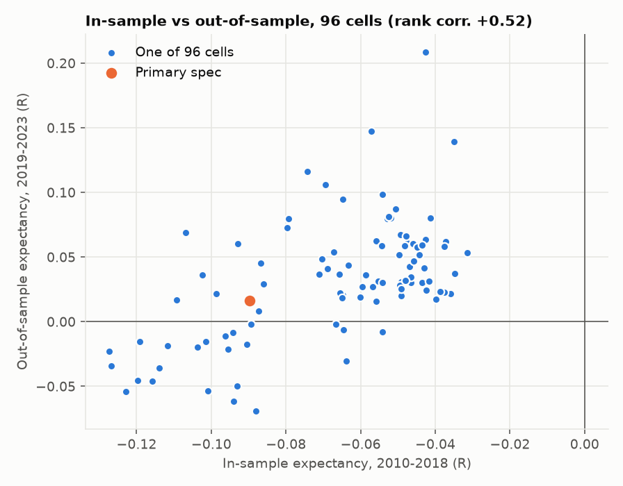
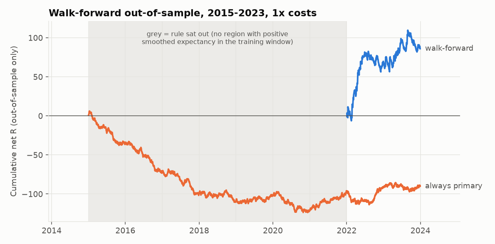

# Validation report (Stage 6)

Development data only (2010-06-08 to 2023-12-29); the 2024+ holdout was **not** loaded. This report executes, without deviation, the protocol that was
written and committed **before any result existed** (`docs/DECISIONS.md`, D4, git commit `57bc384`). All 96 grid cells are recorded as trials
(registry total now **96**). Costs are 1x unless stated. Full numbers: `grid_results.csv`, `walk_forward_folds.csv`.

## 1. The whole grid (not just the good cells)

* Cells with positive **net** expectancy: **5%** (5 of 96). With **zero** costs: **53%** (51 of 96).
* Median net expectancy across the grid: **-0.024 R**; range -0.098 to +0.049 R.
* The primary spec's cell: **-0.051 R** (naive t = -3.08).
* Best raw cell: 5 min, stop 0.5, no target at +0.049 R (naive t = +1.07). For scale: if the 96 cells were *independent noise*, the best naive t-statistic
  would be about **2.49** on average (cells here are strongly correlated, so the true null maximum is lower). The best cell is **below** that level: even before any correction it is not unusual for the best of 96 noise draws.
  Stage 7 does the proper deflated-Sharpe / reality-check correction.

Where the cost drag falls (frictionless minus net expectancy, in R): costs are about the same dollars per trade, but R (the risk unit) is small for short ranges and tight stops, so those cells
give up the most:

| grid slice (averaged over the other parameters) | avg R lost to costs |
|---|---|
| 5 min | 0.058 |
| 10 min | 0.046 |
| 15 min | 0.041 |
| 30 min | 0.033 |
| 45 min | 0.030 |
| 60 min | 0.028 |
| stop 0.5 | 0.059 |
| stop 0.75 | 0.043 |
| stop 1 | 0.033 |
| stop 1.5 | 0.023 |

The frictionless map (second figure) shows a cluster of positive cells for **no target + tight stop + short range** (up to +0.15 R). Most of it is consumed by costs. Note that "no target"
means holding to the time exit at 15:55, so that cluster may simply be riding NQ's strong 2010-2023 drift rather than breakout behaviour: it is a hypothesis for Stage 7
(split long vs short, compare with a same-hold-time benchmark that ignores the breakout), logged as D5, not a finding.

Top and bottom five cells, for transparency (**not** used for selection):

| cell | trades | expectancy (R) | naive t |
|---|---|---|---|
| 5 min, stop 0.5, no target | 3,236 | +0.049 | +1.07 |
| 15 min, stop 0.5, no target | 3,229 | +0.029 | +0.77 |
| 10 min, stop 0.5, no target | 3,234 | +0.017 | +0.44 |
| 45 min, stop 0.5, no target | 3,128 | +0.003 | +0.11 |
| 15 min, stop 0.75, no target | 3,229 | +0.001 | +0.05 |

| cell | trades | expectancy (R) | naive t |
|---|---|---|---|
| 5 min, stop 0.5, 2R target | 3,236 | -0.089 | -3.60 |
| 10 min, stop 0.5, 1R target | 3,234 | -0.090 | -5.09 |
| 5 min, stop 0.75, 1.5R target | 3,236 | -0.093 | -4.33 |
| 5 min, stop 0.5, 1.5R target | 3,236 | -0.093 | -4.28 |
| 10 min, stop 0.5, 1.5R target | 3,234 | -0.098 | -4.56 |

## 2. Selection by the pre-registered rule (smoothed, sit out if no edge)

* Full development period: **sit out** (best smoothed score was -0.003 R, not above 0).

## 3. One in-sample / out-of-sample split (2010-2018 train, 2019-2023 test)

|  | cell | IS expectancy (R) | OOS expectancy (R) | OOS trades |
|---|---|---|---|---|
| Primary spec | 15 min, stop 1, 1R target | -0.090 | +0.016 | 1,178 |
| Best raw cell on IS (illustration only) | 5 min, stop 1.5, no target | -0.031 | +0.053 | 1,181 |

* The average cell scored **-0.067 R** in-sample and **+0.032 R** out-of-sample; the share of positive cells went from 0% to 76%.
  The whole grid moving up together is a **period effect**: 2019-2023 was a kinder period for this strategy family than 2010-2018 whatever the parameters (this is the
  post-hoc regime hypothesis, D3, again; nothing here explains it).
* Across all 96 cells, in-sample and out-of-sample expectancy have rank correlation **+0.52**. Read this carefully: the 96 cells share the same days and largely the same trades, so they are **not
  independent** points and no p-value is reported. A positive rank correlation says the *ordering* of exit structures persisted (for example how costs bite on small-R cells, see section 1), not
  that any cell earns money.
* The ten best cells in-sample averaged **+0.051 R** out-of-sample, against **+0.032 R** for the average cell.

## 4. Walk-forward (train 5 years, test the next year; test years 2015-2023)

| test_year | train | cell | train smoothed (R) | train raw (R) | test trades | test (R) |
|---|---|---|---|---|---|---|
| 2015 | 2010-06-08 to 2014-12-31 | sit out | n/a | n/a | 0 | n/a |
| 2016 | 2011-01-01 to 2015-12-31 | sit out | n/a | n/a | 0 | n/a |
| 2017 | 2012-01-01 to 2016-12-31 | sit out | n/a | n/a | 0 | n/a |
| 2018 | 2013-01-01 to 2017-12-31 | sit out | n/a | n/a | 0 | n/a |
| 2019 | 2014-01-01 to 2018-12-31 | sit out | n/a | n/a | 0 | n/a |
| 2020 | 2015-01-01 to 2019-12-31 | sit out | n/a | n/a | 0 | n/a |
| 2021 | 2016-01-01 to 2020-12-31 | sit out | n/a | n/a | 0 | n/a |
| 2022 | 2017-01-01 to 2021-12-31 | 10 min, stop 0.5, no target | +0.023 | +0.092 | 235 | +0.292 |
| 2023 | 2018-01-01 to 2022-12-31 | 10 min, stop 0.5, no target | +0.062 | +0.136 | 238 | +0.072 |

| 1x costs | Walk-forward rule (2 of 9 years traded) | Primary spec, same years the rule traded | Primary spec, all 9 test years |
|---|---|---|---|
| Out-of-sample trades | 473 | 472 | 2,134 |
| Expectancy (R) | +0.182 | +0.012 | -0.042 |
| Naive 95% CI (R) | -0.040 to +0.404 | -0.074 to +0.099 | -0.082 to -0.003 |
| Total $ (1 NQ) | +71,378 | -698 | -54,531 |

* **The rule sat out 7 of 9 folds**: in those training windows no neighbourhood of the grid had positive smoothed net expectancy. It traded only in: 2022, 2023.
  The fair comparison is therefore the first two columns (the same years), not the third.
* The rule's out-of-sample result rests on only **2 active fold(s)**; its interval includes zero, and a figure from so few years says more about those years than about the rule.
* The walk-forward figure is *higher* than the in-hindsight best in-sample cell (+0.049 R). Selection optimism would push it the other way, so this is **not** an optimism gap: it reflects which years were tested.

## 5. Contract rolls: included vs excluded (same variant, a scenario not a trial)

| Sample (primary spec, 1x costs) | trades | expectancy (R) | naive 95% CI (R) | $ (1 NQ) |
|---|---|---|---|---|
| Roll days excluded (primary) | 3,229 | -0.051 | -0.083 to -0.019 | -69,516 |
| Roll days included | 3,350 | -0.048 | -0.080 to -0.016 | -65,880 |
| Roll days only | 121 | +0.026 | -0.135 to +0.187 | +3,636 |

Roll-day trades are a small slice; if including them changes the answer materially the "exclude rolls" choice would matter. Compare the expectancy columns and their widths.

## 6. Promotion verdict (D4, computed mechanically)

| Criterion (D4) | Result | Detail |
|---|---|---|
| (a) Rule selects a cell on the full development period (smoothed score above 0 at 1x) | FAIL | sit out; best smoothed score -0.003 R |
| (b) Walk-forward out-of-sample net expectancy above 0 | PASS | +0.182 R on 2 active fold(s) of 9; naive 95% CI -0.040 to +0.404 |
| (c) Rule-selected cell has OOS expectancy above 0 on the single split | FAIL | rule selected nothing on the in-sample window |

**Holdout candidates: the primary specification (always).**
At least one criterion failed, so no variant is promoted: only the primary specification will be run on the holdout (D1).

Note on criterion (b): it was pre-registered as "stitched walk-forward expectancy above zero" and is applied exactly as written. As specified it can pass on very few active folds, a weakness of the criterion
(it did not decide the outcome here because (a) failed). The rule is **not** changed after seeing results; the strength of the evidence is judged by the Stage 7 statistics.

## 7. What could invalidate this

* 96 cells on one 13.5-year history: a fortunate cell is expected by chance (section 1). Selection used smoothing precisely to avoid chasing it, but smoothing cannot create information that is not there.
* Cells are strongly correlated (they share the same signals and days), so "96" overstates the number of independent bets while also making naive intervals too narrow.
* R-expectancy is not strictly comparable across stop fractions (R is defined by the stop distance); it measures return per unit of risk taken in that cell.
* The grid and rule were fixed in advance, but the grid itself came from a researcher's idea of what is worth testing; the true number of ideas tried is not zero beyond this.
* Costs are assumptions (1 tick, $2/side); a cell that is positive at 1x may not be at 2x. Frictionless and 1x heatmaps are shown so the cost sensitivity is visible.
