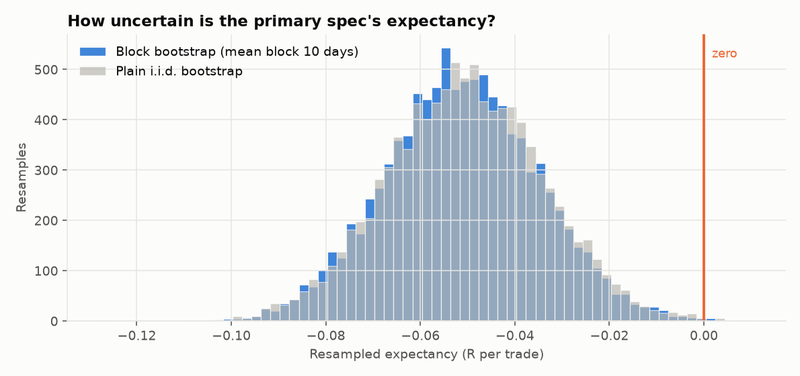
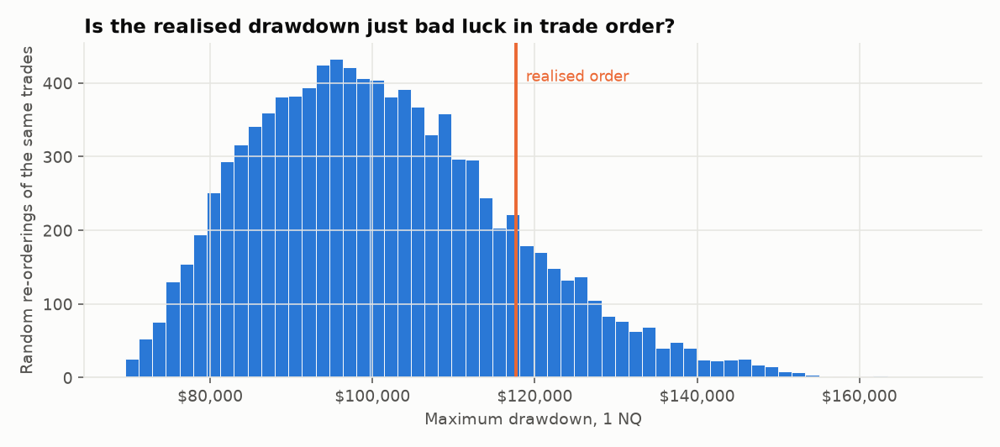
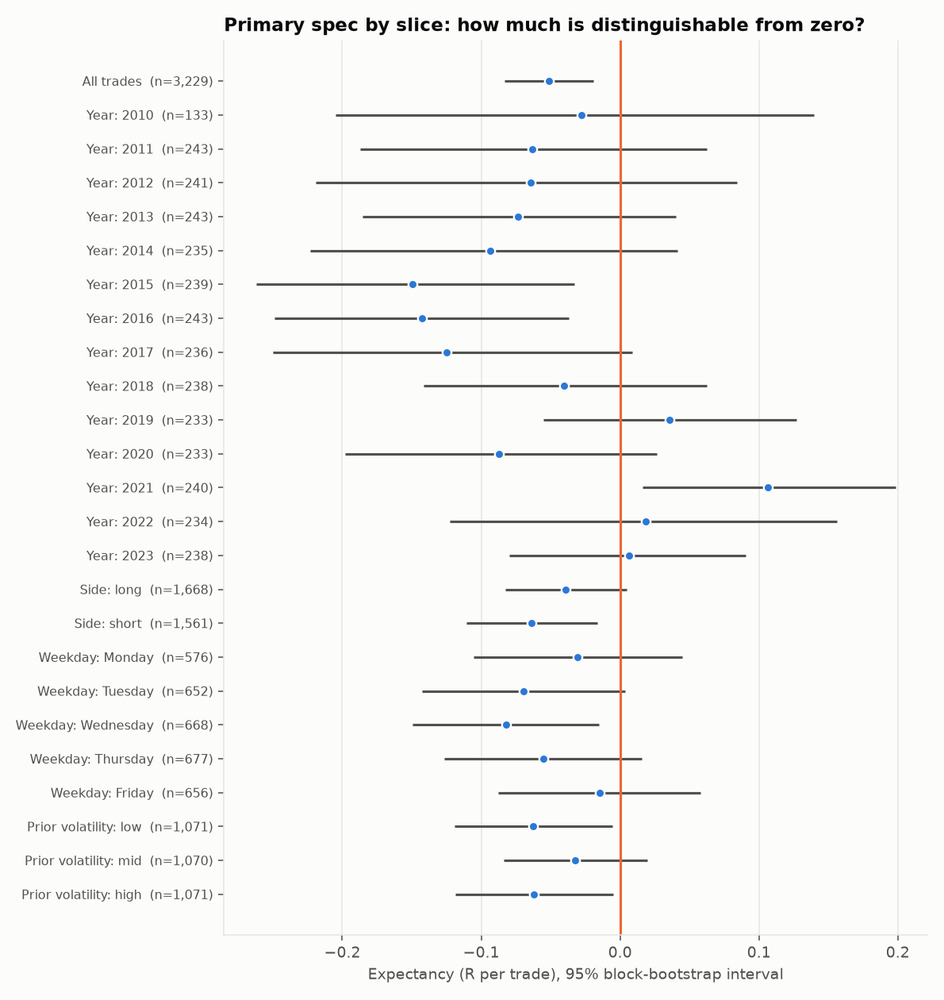
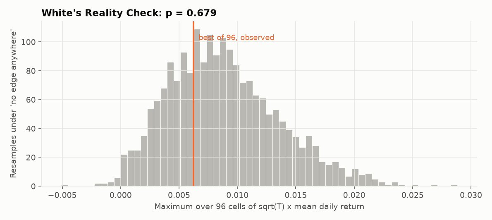

# Robustness report (Stage 7)

Development data only (2010-06-08 to 2023-12-29); the 2024+ holdout was **not** loaded. This executes, without deviation, the protocol committed before any result existed
(`docs/DECISIONS.md`, D6, commit `7ad355d`). Primary specification, 1x costs, unless stated. Trials in the registry: **98** (96 grid cells + the 2 hypotheses of this stage).
Resamples: 10,000 stationary-bootstrap draws, mean block 10 trading days, seed 20261006.

## 1. Bootstrap: how uncertain is the primary result?

| Primary spec, 1x costs | point estimate | 95% interval (block bootstrap, mean block 10 days) |
|---|---|---|
| expectancy (R) | -0.051 | -0.083 to -0.019 |
| win rate | 48.1% | 46.4% to 49.7% |
| profit factor | 0.939 | 0.854 to 1.031 |
| Sharpe (annualised, daily) | -0.780 | -1.295 to -0.255 |
| Sortino (annualised, daily) | -1.055 | -1.698 to -0.372 |
| expectancy (R), plain i.i.d. bootstrap (for comparison) | -0.051 | -0.083 to -0.018 |
| expectancy (R), frictionless (0x costs) | -0.020 | -0.051 to 0.011 |

* The 95% interval for expectancy is **-0.083 to -0.019 R**; in 0.1% of resamples the expectancy was above zero.
  The interval excludes zero on the negative side: the primary spec lost money after costs more consistently than luck would explain.
* The block bootstrap interval is **0.98x** as wide as the plain i.i.d. one. So trade-by-trade results show little serial dependence at this horizon: the i.i.d. interval was not misleadingly narrow here. (Slower, regime-scale effects are examined by year and by volatility below.)
* Frictionless, the expectancy is -0.020 R (interval -0.051 to +0.011).

## 2. Monte Carlo of trade order

Realised maximum drawdown: **$117,661** (1 NQ). Across 10,000 random re-orderings of the same 3,229 trades the maximum drawdown had median **$99,544**
and 5th-95th percentile $78,611 to $129,860. The realised drawdown is at the **85%** percentile.
It sits inside the range of random orderings, so the drawdown itself is not evidence of time clustering.
(Because total P&L is negative, every ordering ends at the same deficit; the shuffle shows how much worse or better the path could have been.)

## 3. Slices with honest intervals

3 of 14 individual years have a block-bootstrap interval that excludes zero (about 0.7 would be expected by chance alone if every year had a true expectancy equal to the overall figure of 0 R).

| slice | trades | expectancy (R) | 95% block interval (R) | includes 0? |
|---|---|---|---|---|
| 2010 | 133 | -0.028 | -0.205 to +0.140 | yes |
| 2011 | 243 | -0.063 | -0.187 to +0.063 | yes |
| 2012 | 241 | -0.065 | -0.219 to +0.084 | yes |
| 2013 | 243 | -0.073 | -0.186 to +0.040 | yes |
| 2014 | 235 | -0.093 | -0.223 to +0.041 | yes |
| 2015 | 239 | -0.150 | -0.262 to -0.033 | NO |
| 2016 | 243 | -0.143 | -0.249 to -0.037 | NO |
| 2017 | 236 | -0.125 | -0.250 to +0.009 | yes |
| 2018 | 238 | -0.041 | -0.141 to +0.062 | yes |
| 2019 | 233 | +0.036 | -0.055 to +0.127 | yes |
| 2020 | 233 | -0.087 | -0.198 to +0.026 | yes |
| 2021 | 240 | +0.106 | +0.016 to +0.198 | NO |
| 2022 | 234 | +0.018 | -0.123 to +0.156 | yes |
| 2023 | 238 | +0.007 | -0.080 to +0.091 | yes |

| slice | trades | expectancy (R) | 95% block interval (R) | includes 0? |
|---|---|---|---|---|
| long | 1,668 | -0.039 | -0.082 to +0.005 | yes |
| short | 1,561 | -0.064 | -0.111 to -0.016 | NO |

| slice | trades | expectancy (R) | 95% block interval (R) | includes 0? |
|---|---|---|---|---|
| Monday | 576 | -0.031 | -0.105 to +0.045 | yes |
| Tuesday | 652 | -0.069 | -0.143 to +0.004 | yes |
| Wednesday | 668 | -0.082 | -0.150 to -0.015 | NO |
| Thursday | 677 | -0.055 | -0.127 to +0.016 | yes |
| Friday | 656 | -0.015 | -0.088 to +0.058 | yes |

Across all 24 slices in this section (years, side, weekday, volatility), 7 have an interval excluding zero, 6 of them on the negative side. Because the overall expectancy is itself negative, negative slices are expected and are not independent findings. Each slice is a chance for a false positive; nothing here is used to select anything.

## 4. Hypothesis D3: does it work better when prior volatility is high?

Measure (fixed in D6): 20-day mean of (RTH high - low)/close **before** the trade date. Thresholds frozen from development trade days and saved to `logs/frozen_vol_thresholds.json`:
low/mid cut **1.031%**, mid/high cut **1.435%** of price.

| slice | trades | expectancy (R) | 95% block interval (R) | includes 0? |
|---|---|---|---|---|
| low | 1,071 | -0.063 | -0.119 to -0.006 | NO |
| mid | 1,070 | -0.032 | -0.084 to +0.020 | yes |
| high | 1,071 | -0.062 | -0.119 to -0.005 | NO |

* High minus low terciles: **-0.000 R**, 95% block interval **-0.081 to +0.082**.
* Verdict under the D6 rule (high-tercile lower bound above zero): **NOT supported on development data** (lower bound -0.119 R).
  It will still be run once on the holdout, as declared in D6, so the answer there is on record either way.

## 5. Hypothesis D5: is the breakout *direction* informative, or is it market drift?

From each primary-spec entry to the 15:55 open, with no stop, no target and no costs:

| Hold-to-close test, primary signals | value |
|---|---|
| Mean hold-to-close return in the signal direction (gross, bps of price) | -0.77 |
| Same, if direction labels were random (mean +/- sd of 20,000 shuffles) | +0.08 +/- 1.60 |
| One-sided permutation p-value | 0.703 |
| Mean over long signals only / short signals only (bps, in trade direction) | +1.69 / -3.39 |
| Always-long benchmark, same entry times (bps) | +2.51 |

* Verdict under the D6 rule (p < 0.05): **NOT supported on development data: the breakout direction does not predict the rest of the day better than shuffled direction labels**.
  Shuffled labels share the same drift, so a good result cannot be produced by the market simply rising.

For the best net cell of the grid (the "no target + tight stop" cluster flagged in Stage 6), descriptively, by side:

| Best net cell: 5 min, stop 0.5, no target | trades | expectancy (R) | avg net points | $ (1 NQ) |
|---|---|---|---|---|
| long | 1,697 | +0.061 | +1.73 | +58,742 |
| short | 1,539 | +0.036 | +1.81 | +55,814 |
| all | 3,236 | +0.049 | +1.77 | +114,556 |

## 6. Multiple testing (96 cells, 1x costs, daily returns on notional)

| N = 98 trials | Best-Sharpe cell | Primary spec |
|---|---|---|
| cell | 5 min, stop 0.5, no target | 15 min, stop 1, 1R target |
| annualised Sharpe (net, 1x) | +0.32 | -0.78 |
| Sharpe expected from the best of N skill-less trials | +0.92 | +0.92 |
| probability true Sharpe > 0 (no deflation) | 0.880 | 0.003 |
| DEFLATED Sharpe ratio (need >= 0.95) | 0.013 | 0.000 |
| distinguishable from noise (DSR >= 0.95 AND RC p < 0.05) | NO | NO |

* **White's Reality Check** (best of 96 against "no cell has positive expected return"): observed statistic 0.0062, **p = 0.679**.
* Variance of Sharpe across cells (daily units) used for the deflation: 5.28e-04.
* Under the D6 thresholds the best cell is **NOT distinguishable** from noise, and the primary spec is **NOT distinguishable**.

## 7. What this does and does not show

* All of this is development data and one history. It can say whether the *observed* results are compatible with no edge; it cannot say what the future holds.
* The deflation counts 98 trials. The true number of ideas considered is at least that.
* Costs are assumptions (1 tick, $2/side). Frictionless and 2x results are in Stage 4 and Stage 6.
* Hypotheses D3 and D5 were formed after seeing development results; their holdout tests (Stage 8) are the real evidence.
